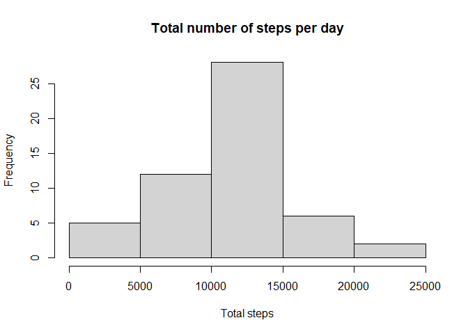
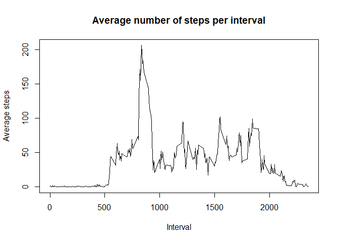
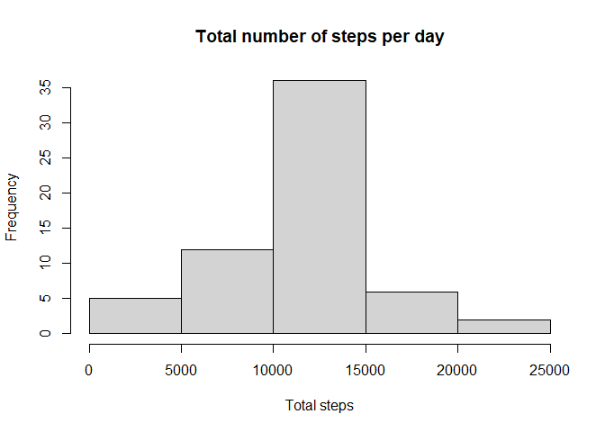
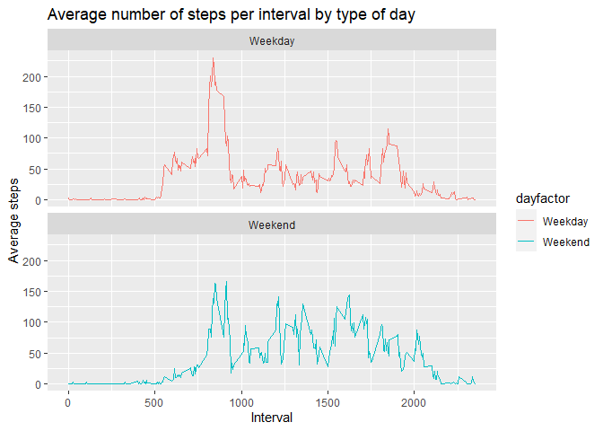

## Loading and procesing the data
1. Load the data

```r
knitr::opts_chunk$set(warning = FALSE)

zip <- unzip("activity.zip")
activity <- read.csv("activity.csv")

activity$date <- as.Date(activity$date, "%Y-%m-%d")
days <- weekdays(activity$date)
activity <- cbind(activity,days)

summary(activity)
```

```
##      steps             date               interval          days          
##  Min.   :  0.00   Min.   :2012-10-01   Min.   :   0.0   Length:17568      
##  1st Qu.:  0.00   1st Qu.:2012-10-16   1st Qu.: 588.8   Class :character  
##  Median :  0.00   Median :2012-10-31   Median :1177.5   Mode  :character  
##  Mean   : 37.38   Mean   :2012-10-31   Mean   :1177.5                     
##  3rd Qu.: 12.00   3rd Qu.:2012-11-15   3rd Qu.:1766.2                     
##  Max.   :806.00   Max.   :2012-11-30   Max.   :2355.0                     
##  NA's   :2304
```

## What is mean total number of steps taken per day?
1. Calculate the total number of steps taken per day.

```r
totalsteps <- aggregate(steps ~ date, activity, sum, na.rm = TRUE)
```

2. Make a histogram of the total number of steps taken each day.

```r
hist(totalsteps$steps, main = "Total number of steps per day", xlab = "Total steps")
```

<!-- -->

3. Calculate and report the mean and median of the total number of steps taken per day.

The mean of the total number of steps taken per day is:

```r
mean(totalsteps$steps, na.rm = TRUE)
```

```
## [1] 10766.19
```

The median of the total number of steps taken per day is:

```r
median(totalsteps$steps)
```

```
## [1] 10765
```

## What is the average daily activity pattern?
1. Make a time series plot of the 5-minute interval (x-axis) and the average number of steps taken, averaged across all days (y-axis).

```r
intervalsteps <- aggregate(steps ~ interval, activity, mean, na.rm = TRUE)

plot(intervalsteps$interval, intervalsteps$steps, type = "l", main = "Average number of steps per interval", xlab = "Interval", ylab = "Average steps")
```

<!-- -->

2. Which 5-minute interval, on average across all the days in the dataset, contains the maximum number of steps?

```r
intervalsteps[which.max(intervalsteps$steps), ]$interval
```

```
## [1] 835
```

## Imputing missing values
1. Calculate and report the total number of missing values in the dataset. 

```r
sum(is.na(activity$steps))
```

```
## [1] 2304
```

2. Devise a strategy for filling in all of the missing values in the dataset. The strategy does not need to be sophisticated. For example, you could use the mean/median for that day, or the mean for that 5-minute interval, etc.

```r
imputation <- intervalsteps$steps[match(activity$interval, intervalsteps$interval)]
```

3. Create a new dataset that is equal to the original dataset but with the missing data filled in.

```r
activity_imputed <- transform(activity, steps = ifelse(is.na(activity$steps), yes = imputation, no = activity$steps))
```

4. Make a histogram of the total number of steps taken each day and calculate and report the mean and median total number of steps taken per day. Do these values differ from the estimates from the first part of the assignment? What is the impact of imputing missing data on the estimates of the total daily number of steps?

```r
totalsteps_imputed <- aggregate(steps ~ date, activity_imputed, sum, na.rm = TRUE)

hist(totalsteps_imputed$steps, main = "Total number of steps per day", xlab = "Total steps")
```

<!-- -->

The mean of the total number of steps taken per day is:

```r
mean(totalsteps_imputed$steps, na.rm = TRUE)
```

```
## [1] 10766.19
```

The median of the total number of steps taken per day is:

```r
median(totalsteps_imputed$steps)
```

```
## [1] 10766.19
```

The mean of the imputed sample is the same in the original sample, but the median increased a little. However, the results are very similar between the original and the imputed databases.

## Are there differences in activity patterns between weekdays and weekends?
1. Create a new factor variable in the dataset with two levels – “weekday” and “weekend” indicating whether a given date is a weekday or weekend day.

```r
activity_imputed$date <- as.Date(activity_imputed$date, format="%Y-%m-%d")

activity_imputed$dayfactor <- sapply(activity_imputed$date, function(x) {
        if (weekdays(x) == "sábado" | weekdays(x) =="domingo") 
                {y <- "Weekend"} else 
                {y <- "Weekday"}
                y
        })

activity_day <- aggregate(steps ~ interval + dayfactor, activity_imputed, mean, na.rm = TRUE)
```

2. Make a panel plot containing a time series plot of the 5-minute interval (x-axis) and the average number of steps taken, averaged across all weekday days or weekend days (y-axis). See the README file in the GitHub repository to see an example of what this plot should look like using simulated data.

```r
library(ggplot2)

plot_days <- ggplot(activity_day, aes(x = interval , y = steps, color = dayfactor)) + geom_line() + labs(title = "Average number of steps per interval by type of day", x = "Interval", y = "Average steps") + facet_wrap(~ dayfactor, ncol = 1, nrow=2)
print(plot_days)
```

<!-- -->


